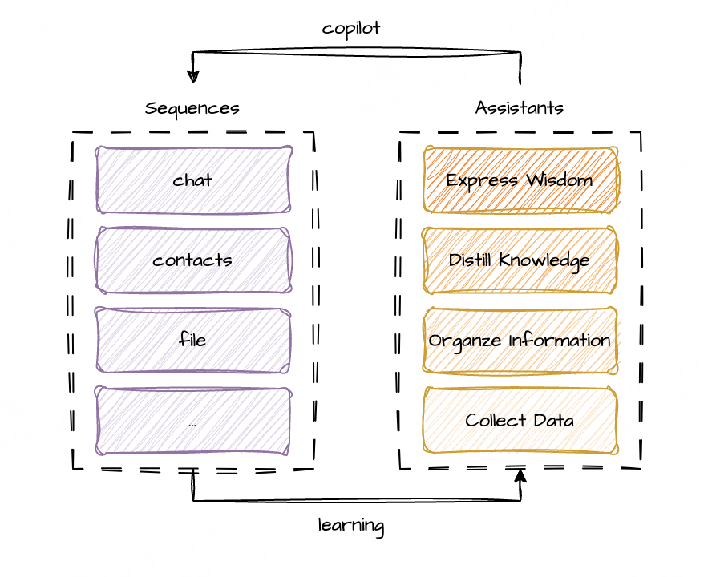

  
  <h1>LinQ</h1>

  

    <strong>Live Simpler With AI</strong> ✨
  

  <!-- SHIELD GROUP -->

[![][version-shield]][version-link]
[![][license-shield]][license-link]
[![][build-shield]][build-link]
[![][coverage-shield]][coverage-link]
[![][issues-shield]][issues-link]
[![][stars-shield]][stars-link]

---

## Overview

**LinQ** is a Linked Sequence platform designed to bring all your digital activities together in one place. By connecting everything you do online into a single, easy-to-follow POD (Personal Online Data), LinQ helps you stay organized and in control. With the power of AI, LinQ acts as your personal assistant, learning from your habits to offer helpful suggestions and make your digital life smoother and more efficient. 🔒🤖

### What is a Sequence?

A **Sequence** is a comprehensive record of all your actions and interactions in your digital life, such as sending messages, receiving emails, and navigating through apps. These actions and interactions are organized into a coherent structure that helps you manage your digital interactions more effectively.

### The Role of the Assistant

Through the power of AI, the Assistant leverages your Sequences to understand what has happened in your digital life. It can answer your questions based on your current context, help manage your Sequences, and even generate a personalized AI tailored to your unique behavior patterns. This personalized AI not only enhances your productivity but also ensures that your digital interactions are as seamless and efficient as possible.

## Features

### Privacy-First Semantic Sequence

- **Secure and Semantic Data Management**: Store chat histories, contacts, and other data in a semantic web format within your [POD (Personal Online Datastore)]https://solidproject.org/), ensuring all information remains under your control and protected. This setup allows for seamless third-party integration while maintaining a strong focus on user privacy, leveraging the secure architecture of [Community Solid Pod 7.0+](https://github.com/CommunitySolidServer/CommunitySolidServer). 🔐🤝

### Interact with Your AI Assistant

- **LobeChat Experience**: Communicate with your AI assistant using the intuitive LobeChat UI(now updated to version 1.36), fully integrated within the [LobeChat ecosystem](https://lobechat.com/docs). This setup leverages LobeChat's comprehensive tools and resources for enhanced digital interactions. 🤖🌐

## Contributing

We welcome contributions! Please see our [contributing guidelines](CONTRIBUTING.md) for more details. 🙌

## License

This project is licensed under the Apache 2.0 License - see the [LICENSE](LICENSE) file for details. 📄

[![][back-to-top]](#readme-top)

<!-- SHIELD LINKS -->

[back-to-top]: https://img.shields.io/badge/-BACK_TO_TOP-151515?style=flat-square
[build-link]: https://github.com/undefineds-co/undefineds/actions
[build-shield]: https://img.shields.io/github/actions/workflow/status/undefineds-co/undefineds/ci.yml?label=build&logo=github
[coverage-link]: https://codecov.io/gh/undefineds-co/undefineds
[coverage-shield]: https://img.shields.io/codecov/c/github/undefineds-co/undefineds?logo=codecov
[issues-link]: https://github.com/undefineds-co/undefineds/issues
[issues-shield]: https://img.shields.io/github/issues/undefineds-co/undefineds?logo=github
[license-link]: LICENSE
[license-shield]: https://img.shields.io/badge/license-Apache%202.0-blue
[stars-link]: https://github.com/undefineds-co/undefineds/stargazers
[stars-shield]: https://img.shields.io/github/stars/undefineds-co/undefineds?logo=github
[version-link]: https://github.com/undefineds-co/undefineds/releases
[version-shield]: https://img.shields.io/badge/version-0.0.1-purple
